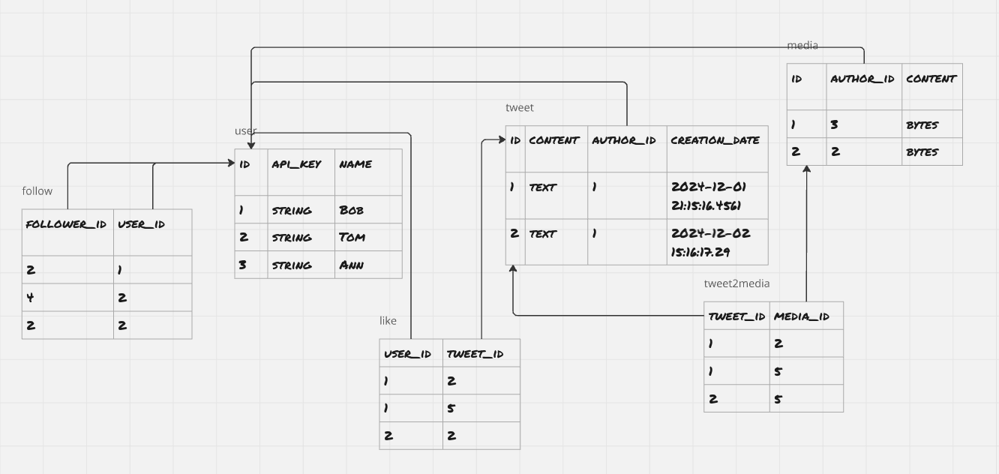

<h1 align="center">Python Сервис микроблогов</h1>

<h3 align="center">
    
    <!-- 
     -->
</h3>

Back-end сервиса микроблогов-аналога Twitter, реализованный с использованием языка python и асинхронного фреймровка FastAPI.

## О поекте
На данный момент сервис представляет собой REST API, позволяющий:
 * создавать и удалять твиты, просматривать ленту на основе интересующих авторов
 * зафолловить другого пользователя и перестать
 * лайкать твиты и убирать лайки
 * просматривать свой и чужой профили

<!-- Для реализации всех этих возможностей, в качестве каркаса для микроблог-сервиса был выбран FastAPI, так как он обладает следующими преимуществами:

##### Асинхроность
FastAPI был первым веб-каркасом, поддерживающим асинхронную обработку запросов с использованием конструкций `async`/`await`.

##### Актуальность
Фреймворк появился совсем недавно, активно поддерживается.

##### Независимость
В отличие от больших, корпоративных решений, вроде Django, FastAPI из коробки предоставляет лишь базовые возможности и неограничивает построение архитектуры приложения. Это позволяет выбрать только те расширения, которые действительно нужны в проекте самостоятельно спроектировать архитектуру. -->
#### База данных
За хранение данных приложения отвечает выделенный сервер **PostgeSQL**. База имее следующюю структуру:

*Для визуализации была использована доска  miro*

#### Асинхронные запросы
Сервис полностью асинхронный, все endpoint'ы являются корутинами. При большой нагрузке, пользователи не будут ждать, пока кто-то другой получит ответ от сервера. Так как основная задержка происходит в момент ожидания ответа от базы данных, запросы к ней также выполняются асинхронно.


<!-- ### Run application:
```
docker compose -f Docker/docker-compose.yml --env-file config/.env up --build
```
### Running services separately:
##### database:
```
docker run --name microblog-database -e POSTGRES_DB=microblog -e POSTGRES_USER=postgres -e POSTGRES_PASSWORD=postgres -dp 5432:5432 --restart unless-stopped -v ./.postgres:/var/lib/postgresql/data postgres:14.12
```
##### server:
```
docker build -t microblog-server -f Docker/server.Dockerfile .
docker run --name microblog-server -p 80:80 --restart unless-stopped -d microblog-server
``` -->
